# Overview:

  * This Repository's README file with the screenshots were created/updated during taking a course by [Jonas Schmedtmann](https://codingheroes.io/)
  * This repo contains three main projects that uses `Advanced` css technologies, namely:

    1. Natours Project (Advanced CSS with SaSS)
    2. Trillo Project (Flexbox)
    3. Nexter Project (CSS Grid layouts)

  * Each project Directory will have a README file with notes about challenges and gotchas faced during building the project.

## How CSS Works? (Behind The Scene):

  #### Three Golden Rules When Building HTML & CSS:

  1. Responsive Design: Websites should work responsively to any device they work on, topics like fluid layouts, media queries, responsive images, correct units, and desktop-first vs mobile-first approaches are crucial.

  2. Maintainable and scalable code: topics like how to organize files, how to name html classes, and even how to structure HTML tags.

  3. Web Performance: less size, and fast app. Somethings to consider are less HTTP requests, Less Code, Compress Code, use CSS preprocessor (like SaSS), **less images**, and compress images.

  #### What Actually Happens?

  ##### Overview

  * The step `Process final CSS Values` is when units like `%` gets converted to `px`.
  * the visual formatting model uses the `box-model`, `floats` and `positioning` to render the CSS.

  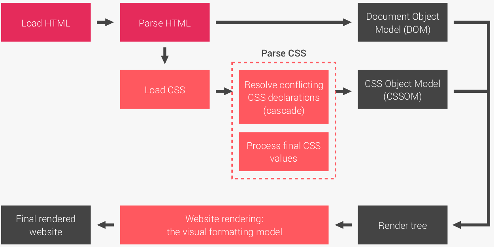

  ##### CSS Parsing phase - cascading step:

  * A css rule consists of a selector and a declaration block.
  * Step One: Cascading. When combining different stylesheets and resolving conflicts between different CSS rules and declarations when more than one rule apply to certain element.
  * There are three types of stylesheets (Author, user, browser) - Author: is what we write as developers, user: when a user change his browser font size, and browser: default appearance of tags differ from browser to another one.

  * **BUT how conflicts are resolved?** => First look at the *Importance*, then *Selector Specificity*, and the *source order*.

  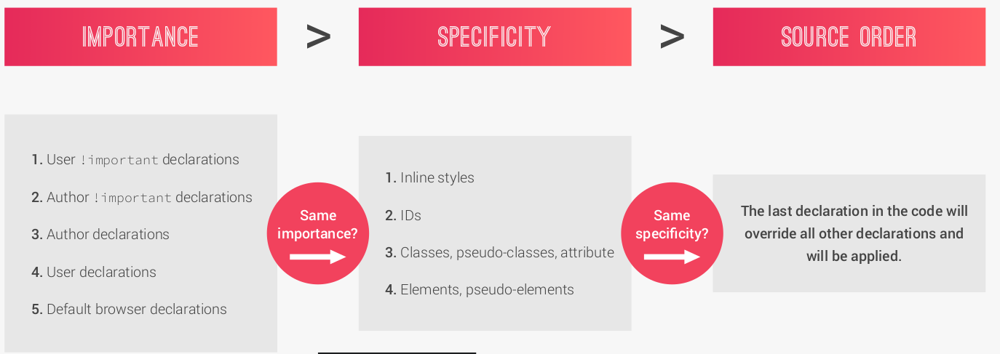

  * An Example of how specificity is calculated:
    - Each rule will be assigned a tuple of numbers, and then compare the first number in all tuple, if there is a tie, move to second number and compare them (only the rules with a tie), until reaching the last number.
    - The value/rule chosen is called cascaded value. 

  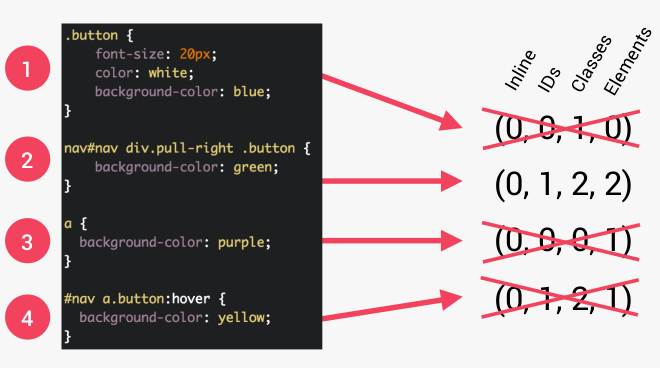

  - Declarations with `!important` have the highest priority.
  - but avoid using them in favor of writing maintainable code.
  - inline styles will always have priority over styles in the stylesheets.
  - Selector with **one** ID is more specific than a one with **1000** classes.
  - The universal selector `*` has a specificity of `(0, 0, 0, 0)`.
  - Always rely on specificity, not order, not inline, not important, so that the code would be more maintainable.
  - But rely on order when using 3rd-party library - always put your author stylesheet last.

  ##### CSS value parsing - value processing step:

  * Any value goes through a six steps conversion process as indicated below.

  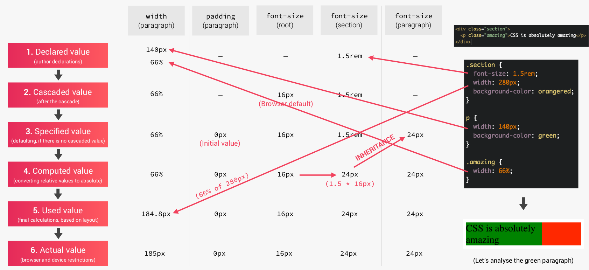

  * Also, the relative units get converted to pixels as indicated below:

  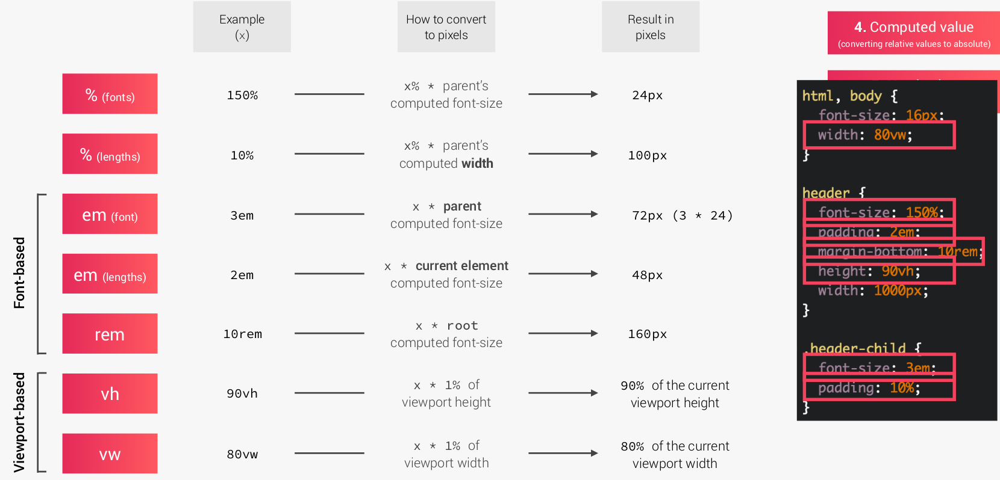

  * Each property has an initial value, used if nothing is declared (and if there is no inheritance);
  * Browsers specify a root font-size for each page (usually 16px);
  * Percentages and relative values are always converted to `pixels`;
  * Percentages are measured relative to their **parent’s** `font-size`, if used to specify `font-size`;
  * Percentages are measured relative to their **parent’s** `width`, if used to specify `lengths`;
  * `em` are measured relative to their **parent** `font-size`, if used to specify `font-size`;
  * `em` are measured relative to the **current** `font-size`, if used to specify `lengths`;
  * `rem` are always measured relative to the document’s **root** font-size;
  * vh and vw are simply percentage measurements of the viewport’s height and width.

  ##### CSS value parsing - Inheritance:

  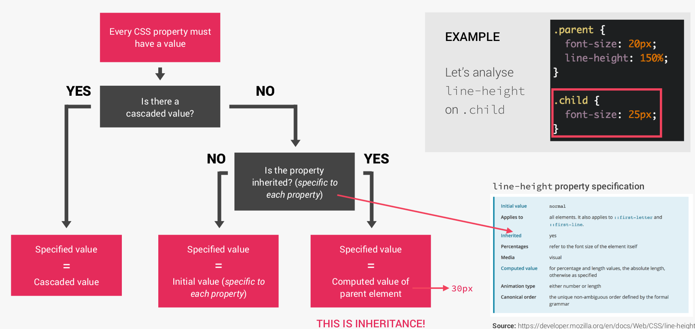

  * Inheritance passes the values for some specific properties from parents to children — more
  maintainable code;
  * Properties related to text are inherited: font-family, font-size, color, etc;
  * The computed value of a property is what gets inherited, not the declared value.
  * Inheritance of a property only works if no one declares a value for that property;
  * The inherit keyword forces inheritance on a certain property;
  * The initial keyword resets a property to its initial value.

  ##### CSS Visual Formatting Model:

  * Is an algorithm that calculates boxes and determines the layout of these boxes, for each element in the render tree, in order to determine the final layout of the page.
  * It determines the following:
    1. **Dimensions of the boxes: the box model**.
    2. **Box type: inline, block, inline-block**.
    3. **Positioning Scheme: float and positioning**.
    4. **Stacking contexts**;
    5. Other elements in the render tree;
    6. Viewport size, dimensions of images, etc.

  **The Box Model**:

  - Determines how each element will appear on the screen. It can be thought of as a rectangle with height, width, border, padding and margin.

  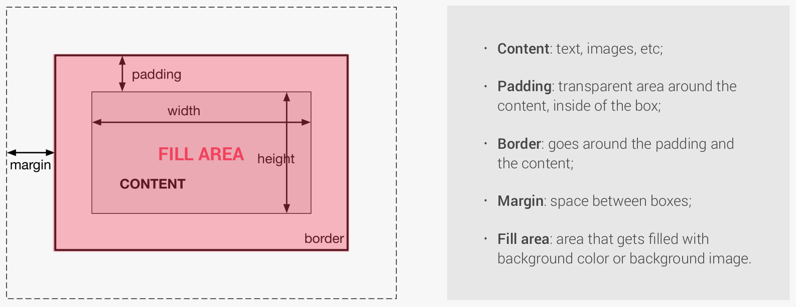

  - the width of a box is `right border + right padding  + specified width + left padding + left border`.
  - the height of a box is `top border + top padding  + specified height + bottom padding + bottom border`.

  - The box-sizing's value of border-box:  padding and border will be included in the specified width/height.

  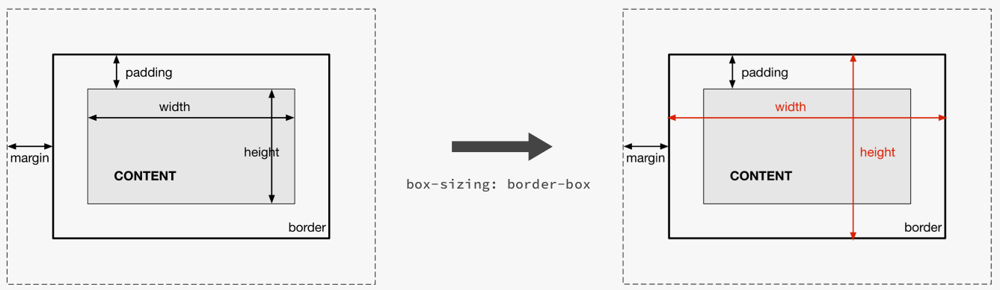

  **Boxes Types**:

  - There are three main box types, shown below:

  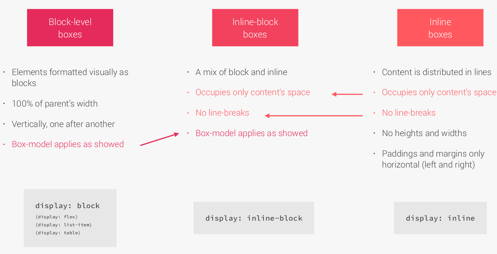

  **Positioning Schemes**:

  - three schemes are involved when positioning any css element.
  - Since absolute positioning does not affect surrounding elements and they may overlap, css has what is known as stacking context that determines in which order elements are shown (layer above layer)

  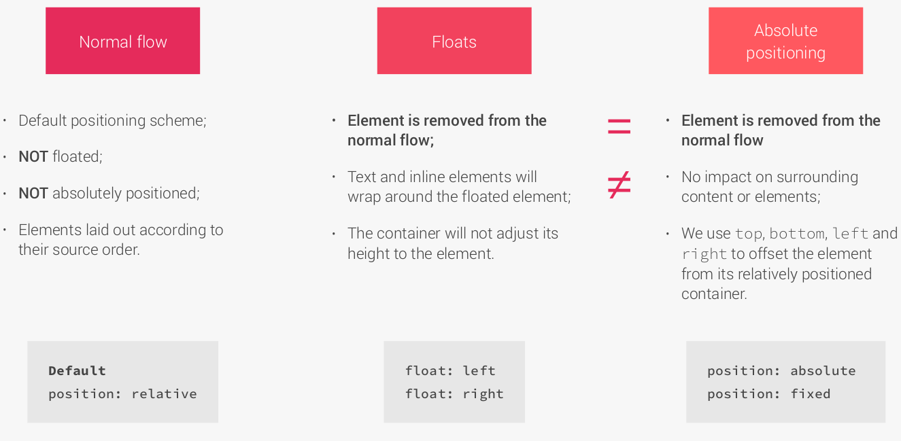

  **Stacking Context**:

  - Determines in which order elements are shown on the screen.
  - The most famous rule creating new context is the `z-index` property.
  - Note that opacity different from `1` or another transform creates new stacking context.

  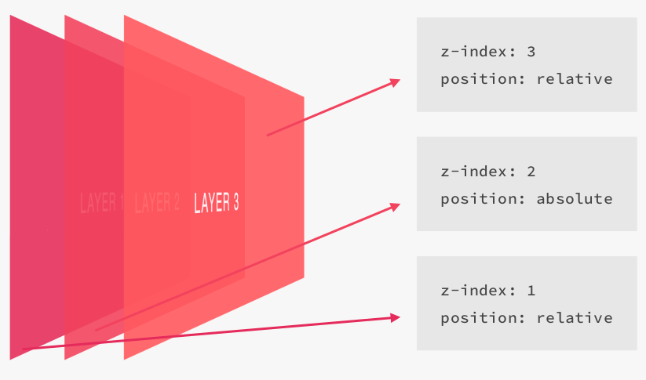

  #### CSS Sheets Architecture:

  - the process is divided into three main steps, 1. Think, 2. Build, and 3. Architect.

  1. **Think process**:

  * Use Component-Driven design, by dividing our pages into modular components.
  * What is a component? Modular building block that make up interfaces, that are held together by the layout (html) of the page.
  * Components are reusable (in one or multiple projects) and independent (use them anywhere on the page - should not depend on their parents).
  * These rules could be broken if we have a necessity.
  * Components are like `Organisms` in Atomic Design.

  2. **Build Process**:

  * code the design by using html and css, but we have to think of naming classes.
  * We will follow `BEM` methodology for naming our classes.
  * BEM's BLOCK => standalone component that is meaningful on its own.
  * BEM's ELEMENT => part of the block, has no standalone meaning.
  * BEM's MODIFIER => flag that make a different version of an element.
  * BEM is very popular because it creates a very low specificity selector which result in a more maintainable code.

  3. **Architect Process**:

  * There are some methodologies like `its-css` , `SMACSS`, bit we will use `seven-one` pattern.
  * `7` different folders for partial SaSS files, and `1` main SaSS file to import all other files into a compiled CSS stylesheet.
  * the `7` folders are: 
    1. base: basic product definitions.
    2. components: one file for each component.
    3. layout: define overall layout of the project.
    4. pages: define styles for specific pages
    5. themes: implementing different themes
    6. abstracts: code that does not produce any css, like variables, or mixins.
    7. vendors: all 3rd-party css.

  * Not all 7 folders needs to be present, this depends on the project scale.